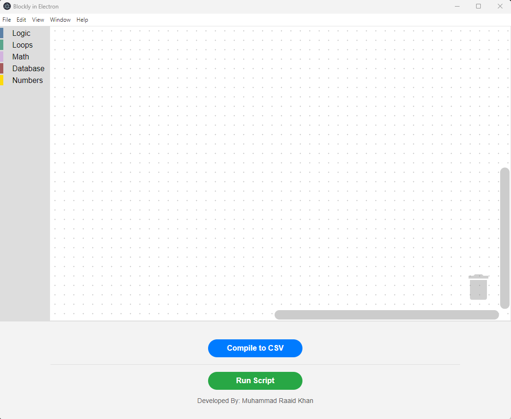
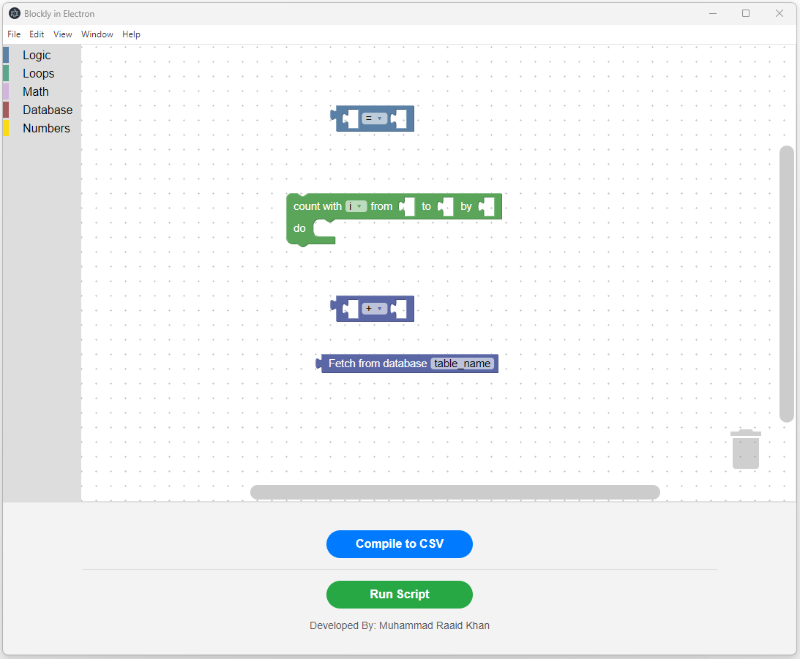
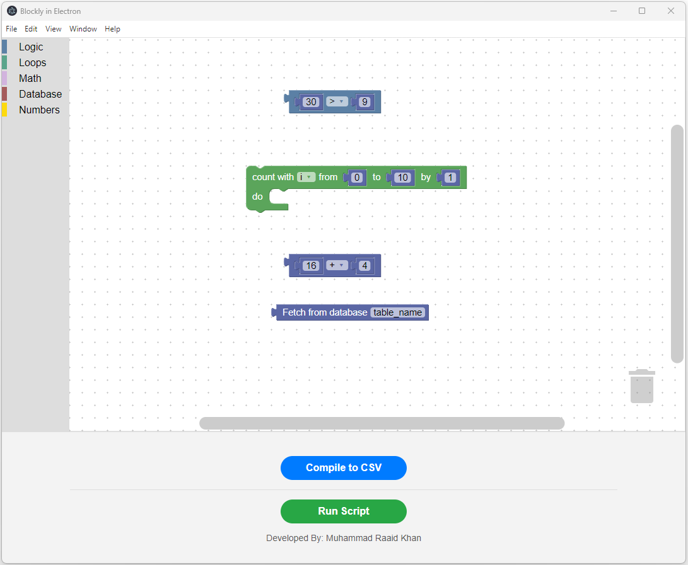
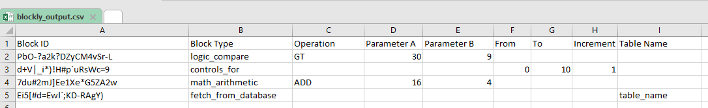
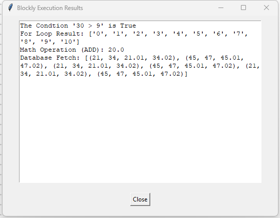
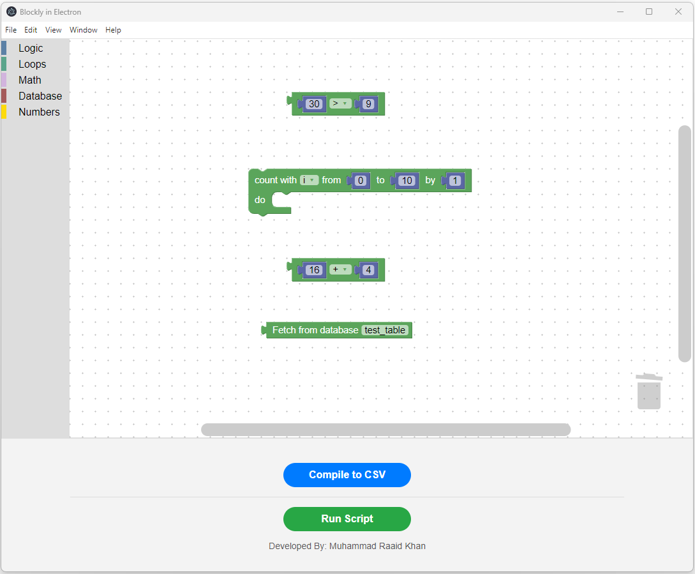
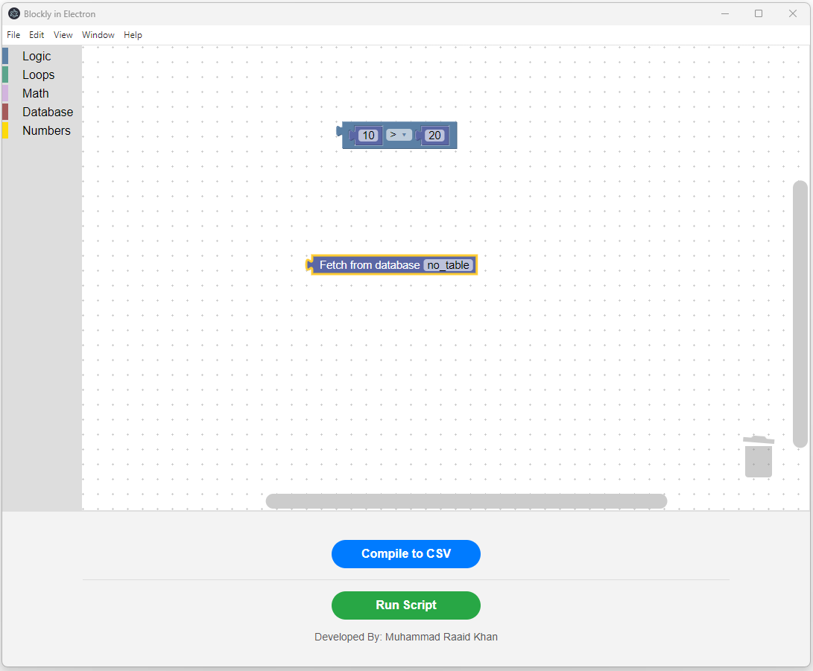
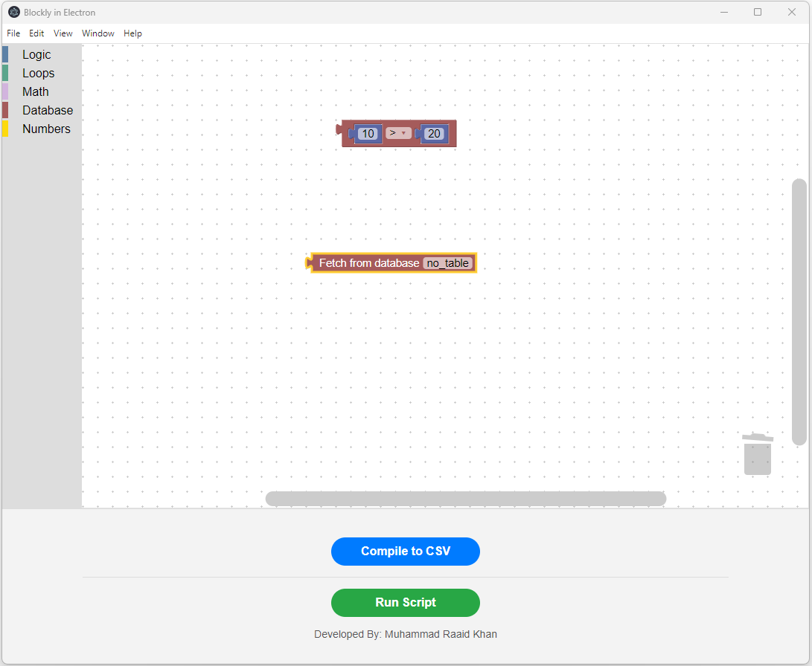

## Developed By

**Muhammad Raaid Khan**

## Installation Instruction

* Clone the Repository
* Run command `npm install electron` in the folder to install *Electron*
* Run command `npm start` to run the application

## Main GUI

Below it the Main GUI Window

## Adding Blocks

* Blockly blocks can be added from the Left
  
* Numbers Can be Added into Blocks
  

## Compiling CSV

* On Clicking `Compile to CSV` button, a CSV File will be created in folder `/csv_output
* Below is the contents of CSV file
  

## Running Script

* On Clicking `Run Script` button, a Python Script will be executed.
* Outputs are shown in *Tkinter* Window
  

## Output Results 
* In case the execution of block is done correctly, it will turn **Green**
  
  * Websockets are implemented to send status from Python Backend to Electron Frontend

## False Output

* In case the execution of block is False, it will turn **Red**
  
* Compiling to CSV
* Running Script
  